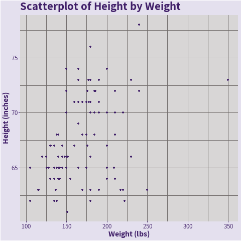
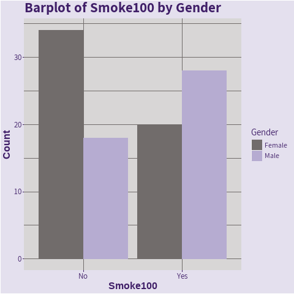
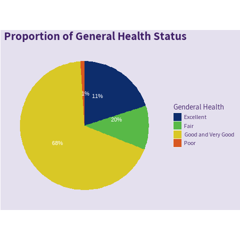

```{r global_options, include = FALSE}
library(knitr)
opts_chunk$set(warning = FALSE, message = FALSE, comment = FALSE, dpi = 300)
```

## Overview

The goal of this lab is to play around with the theme options in `ggplot2` 

## Datasets

We'll be using the `cdc.txt` datasets.

<br>

```{r load-packages-data-seed}
# Load package(s)
library(tidyverse)
library(ggthemes)
library(ggpubr)
library(showtext)

# Read in the cdc dataset
cdc <- read_delim(file = "data/cdc.txt", delim = "|") %>%
  mutate(genhlth = factor(genhlth,
    levels = c("excellent", "very good", "good", "fair", "poor"),
    labels = c("Excellent", "Very Good", "Good", "Fair", "Poor")
  ))

# Set seed
set.seed(8221984)

# Selecting a random subset of size 100
cdc_small <- cdc %>% sample_n(100)
```

<br>

## Exercises

Complete the following exercises.

<br>

### Exercise 1

Use the `cdc_small` dataset to explore several pre-set `ggthemes`. The code below constructs the familiar scatterplot of `weight` by `height` and stores it in `plot_01`. Display `plot_01` to observe the default theme. **Explore/apply, and display at least 7 other pre-set themes** from the `ggplot2` or `ggthemes` package. Don't worry about making adjustments to the figures under the new themes. Just get a sense of what the themes are doing to the original figure `plot_01`. 

Which theme or themes do you particularly like? Why? There should be at least 8 plots for this task. `temp1` is pictured below.

<br>

```{r base-plot-ex01, warning=FALSE}
# Building plot
plot_01 <- ggplot(data = cdc_small, 
                  aes(x = height, 
                      y = weight)) +
  
  geom_point(size = 3, 
             aes(shape = genhlth, 
                 color = genhlth)) +
  
  scale_y_continuous(
    name = "Weight in Pounds",
    limits = c(100, 300),
    breaks = seq(100, 350, 25),
    trans = "log10",
    labels = scales::unit_format(unit = "lbs")
  ) +
  
  scale_x_continuous(
    name = "Height in Inches",
    limits = c(55, 80),
    breaks = seq(55, 80, 5),
    labels = scales::unit_format(unit = "in", accuracy = 1)
  ) +
  
  scale_shape_manual(
    name = "General\nHealth?",
    labels = c("Excellent", "Very Good", "Good", "Fair", "Poor"),
    
    values = c(17, 19, 15, 9, 4)
  ) +
  scale_color_brewer(
    name = "General\nHealth?",
    labels = c("Excellent", "Very Good", "Good", "Fair", "Poor"),
    palette = "Set1"
  ) +
  
  theme(
    legend.position = c(1, 0),
    legend.justification = c(1, 0)
  ) +
  
  labs(title = "CDC BRFSS: Weight by Height")


plot_02 <- plot_01 + theme_void()

plot_03 <- plot_01 + theme_minimal()

plot_04 <- plot_01 + theme_classic()

plot_05 <- plot_01 + theme_light()

plot_06 <- plot_01 + theme_dark()

plot_07 <- plot_01 + theme_bw()

plot_08 <- plot_01 + theme_tufte()

plot_09 <- plot_01 + theme_solarized()

plot_10 <- plot_01 + theme_excel()

ggarrange(plot_01, plot_02, 
          ncol = 2, 
          labels = c("Theme", "Thme Void"), 
          font.label = list(size = 10, color = "red"), 
          hjust = c(-1, -1), 
          vjust = c(4, 4), 
          widths = c(10, 10), 
          align = "h")
          
     
ggarrange(plot_03, plot_04, 
          ncol = 2, 
          labels = c("Theme Minimal", "Theme Classic"),
          font.label = list(size = 10, color = "red"), 
          hjust = c(-1, -1), 
          vjust = c(4, 4), 
          widths = c(10, 10), 
          align = "h")  

ggarrange(plot_05, plot_06, 
          ncol = 2, 
          labels = c("Theme Light", "Theme Dark"),
          font.label = list(size = 10, color = "red"), 
          hjust = c(-1, -1), 
          vjust = c(4, 4), 
          widths = c(10, 10), 
          align = "h")   

ggarrange(plot_07, plot_08, 
          ncol = 2, 
          labels = c("Theme bw", "Theme Tufte"), 
          font.label = list(size = 10, color = "red"), 
          hjust = c(-1, -1), 
          vjust = c(4, 4), 
          widths = c(10, 10), 
          align = "h")   

ggarrange(plot_09, plot_10, 
          ncol = 2, 
          labels = c("Theme Solarized", "Theme Excel"),
          font.label = list(size = 10, color = "red"), 
          hjust = c(-1, -1), 
          vjust = c(4, 4), 
          widths = c(10, 10), 
          align = "h")   


```

<strong>Which Plot I Like?</strong>

1. Plot_01: theme

I do NOT like this one because the legend is inside the panel and it's taking up a lot of spaces and is distracting. 

2. Plot_02: theme_void

I do NOT like this one because there is neither x-axis nor y-axis so it is hard to what the plot is trying to show (i.e. what is the meaning of the position of the data points). 

3. Plot_03: theme_minimal

I like this one because it shows clearly the relationship between weight and height of people by general health status. Both axes are clearly labeled. The panel grid has light color and the background color is white which helps to visualize data points. 

4. Plot_04: theme_classic

I like this one because the same reason as plot_03. The relationship is clearly conveyed. If we are not interested in specific values of data points, then panel grid is not necessary. But if we do want to identify the value of each point then having panel grid will be helpful. 

5. Plot_05: theme_light

I like this one because the same reason as plot 3. There is only slight difference between theme_light and theme_minimal and both are good at conveying the relationship between weight and height by general health status. 

6. Plot_06: theme_dark

I do NOT like this one because the dark panel background is distracting and make it hard to see some data points because their colors do not stand out. For example, it is really hard to see data points of fair and poor general health conditions. 

7. Plot_07: theme_bw

I like this one for the same reason as plot_03 and plot_04.

8. Plot_08: theme_tufte

I think this one if ok if we just want to show the relationship of height and weight by general health status. However, it is hard to identify values of data points because there is no panel grid. 

9. Plot_09: theme_solarized

I think this one is ok because the panel background color is light so it is not as distracting and does not obscure data points. 

10. Plot_10: theme_excel

I do NOT like this one because the panel background color is dark and is distracting. 
<br>


### Exercise 2

Using `plot_01` from  and the `theme()` function, attempt to construct the ugliest plot possible (example pictured below).

<br>
```{r, warning=FALSE}

plot_01 + theme(
  #### Plot ####
  plot.background = element_rect(fill = "orange"),
  
  plot.title = element_text(color = "darkblue", 
                            size = 12, 
                            face = "bold"),
  
  #### Axis ####
  axis.text.y = element_text(color = "darkgreen", 
                             size = 8, 
                             angle = 180),
  
  axis.text.x = element_text(color = "red", 
                             size = 8, 
                             angle = 135),
  
  axis.title.y = element_text(color = "red", 
                              size = 12, 
                              face = "bold"),
  
  axis.title.x = element_text(color = "darkgreen", 
                              size = 12, 
                              face = "bold"),
  
  axis.ticks = element_line(color = "darkblue", 
                            size = 4),
  
  #### Legend ####
  legend.key = element_rect(color = "pink", 
                            fill = "lightblue"),
  
  legend.title = element_text(color = "purple", 
                              face = "bold"),
  
  legend.text = element_text(color = "purple", 
                             face = "bold"), 
  
  #### Panel ####
  panel.background = element_rect(color = "lightblue", 
                                  fill = "pink"), 
  
  panel.grid.major.y = element_line(color = "yellow", 
                                    size = 1.5),
  
  panel.grid.minor.y = element_line(color = "purple", 
                                    size = 1.5),
  
  panel.grid.major.x = element_line(color = "red"),
  panel.grid.minor.x = element_line(color = "lightblue",
                                    linetype = "dotted",
                                    size = 1.5)
)

```


<br>

### Exercise 3

Using data from `cdc_small` create a few (at least two) graphics (maybe one scatterplot and one barplot). Style the plots so they follow a "Northwestern" theme. Check out the following webpages to help create the theme:

[Visual Identity](https://www.northwestern.edu/brand/visual-identity/index.html)

- [Web Colors](https://www.northwestern.edu/brand/visual-identity/color/digital-colors.html)
- [Secondary Palette](https://www.northwestern.edu/brand/visual-identity/color/secondary-palette.html)
- [Fonts & Typography](https://www.northwestern.edu/brand/visual-identity/fonts-typography/index.html) --- Need to use [substitute fonts](https://www.northwestern.edu/brand/visual-identity/fonts-typography/substitute-fonts.html)

<br>

Add font

```{r, warning=FALSE}
## Loading a Google font (http://www.google.com/fonts)
font_add_google("Assistant", "Assistant")

```


__Exercise 3 Plot 1__
```{r, warning=FALSE, fig.showtext = TRUE}

png("lab9_exe3_p1.png")

showtext_begin()

ggplot(cdc_small, aes(weight, height)) +
  
  geom_point(color = "#401F68") + 
  
  labs(title = "Scatterplot of Height by Weight", 
       x = "Weight (lbs)", 
       y = "Height (inches)") +
  
  theme(
    #### Plot ####
    plot.background = element_rect(fill = "#E4E0EE"), 
    
    plot.title = element_text(color = "#401F68", 
                              size = 17, 
                              face = "bold", 
                              family = "Assistant"),
    
    #### Axis ####
    axis.text = element_text(color = "#401F68", 
                             size = 10, 
                             family = "Assistant"),
    
    axis.title = element_text(color = "#401F68", 
                              size = 12, 
                              face = "bold", 
                              family = "Assistant"),
    
    axis.ticks = element_line(color = "#401F68", 
                              size = 0.5),
    
    #### Panel ####
    panel.background = element_rect(fill = "#D8D6D6"),
    
    panel.grid.major = element_line(color = "#716C6B"),
    
    panel.grid.minor = element_line(color = "#716C6B")
  )

showtext_end()

dev.off()
```



__Exercise 3 Plot 2__
```{r, warning = FALSE, fig.showtext = TRUE}

png("lab9_exe3_p2.png")

showtext_begin()

ggplot(cdc_small, aes(as.factor(smoke100))) +
  
  geom_bar(aes(color = gender, 
               fill = gender), 
               position = "dodge") + 
  
  scale_x_discrete(labels = c("No", "Yes")) +
  
  scale_color_manual(values = c("#716C6B", "#B6ACD1"), 
                     labels = c("Female", "Male")) + 
  
  scale_fill_manual(values = c("#716C6B", "#B6ACD1"), 
                     labels = c("Female", "Male")) +
  
  labs(title = "Barplot of Smoke100 by Gender", 
       x = "Smoke100", 
       y = "Count", 
       color = "Gender", 
       fill = "Gender") +
  
  theme(
    #### Plot ####
    plot.background = element_rect(fill = "#E4E0EE"), 
    
    plot.title = element_text(color = "#401F68", 
                              size = 17, 
                              face = "bold", 
                              family = "Assistant"),
    
    #### Axis ###
    axis.title = element_text(color = "#401F68", 
                              size = 12, 
                              face = "bold"),
    
    axis.ticks = element_line(color = "#401F68", 
                              size = 0.5),
    
    axis.text = element_text(color = "#401F68", 
                             size = 10, 
                             family = "Assistant"),
    
    #### Panel ####
    panel.background = element_rect(fill = "#D8D6D6"),
    
    panel.grid.major = element_line(color = "#716C6B"),
    
    panel.grid.minor = element_line(color = "#716C6B"),
    
    
    #### Legend ####
    legend.background = element_rect(fill = "#E4E0EE"), 
    
    legend.text = element_text(color = "#401F68", 
                               family = "Assistant"), 
    
    legend.title = element_text(color = "#401F68", 
                                family = "Assistant")
  )

showtext_end()

dev.off()

```




__Exercise 3 Plot 3__
```{r, warning=FALSE, fig.showtext = TRUE}

png("lab9_exe3_p3.png")

showtext_begin()

cdc_small <- cdc_small %>%
  
  mutate(
    genhlth_reclass = case_when(
      genhlth ==  "Excellent" ~ "Excellent",
      
      genhlth %in% c("Good", "Very Good") ~ "Good and Very Good",
      genhlth == "Fair" ~ "Fair",
      
      genhlth == "Poor" ~ "Poor"
    )
  )


cdc_small_count <- cdc_small %>%
  
  group_by(genhlth_reclass) %>%
  
  summarise(
    count = n(),
    
    pct = count / nrow(cdc_small) * 100
  ) %>%
  
  arrange(desc(count)) %>%
  
  mutate(
    laby = cumsum(count) - 0.5 * count
  )
 


ggplot(data = cdc_small_count, 
       aes(x = factor(1), 
           y = count, 
           fill = genhlth_reclass)) + 
  
  geom_bar(stat = "identity", width = 1) +
  
  geom_text(aes(x = factor(1), 
                y = laby, 
                label = paste(pct, "%", sep="")), 
            size = 3, 
            color = "white") +
  
  coord_polar("y", start = 0, direction = -1) +
  
  scale_fill_manual(
      values = c("#0D2D6C", "#58B947", "#D9C826", "#D85820"), 
        labels = c("Excellent", "Fair", "Good and Very Good", "Poor")) + 
  
  labs(title = "Proportion of General Health Status", 
       x = NULL, 
       y = NULL, 
       fill = "Genderal Health" ) +
  
  theme(
    #### Plot ####
    plot.background = element_rect(fill = "#E4E0EE"), 
    
    plot.title = element_text(color = "#401F68", 
                              size = 17, 
                              face = "bold", 
                              family = "Assistant"),
    
    #### Axis ####
    axis.text = element_blank(),
    
    axis.ticks = element_blank(),
    
    #### Panel ####
    panel.background = element_rect(fill = "#E4E0EE"),
    
    panel.grid = element_blank(),
    
    #### Legend ####
    legend.background = element_rect(fill = "#E4E0EE"),
    
    legend.text = element_text(color = "#401F68", 
                               family = "Assistant"), 
    
    legend.title = element_text(color = "#401F68", 
                                family = "Assistant")
    
  )
  
  
showtext_end()

dev.off()


```



